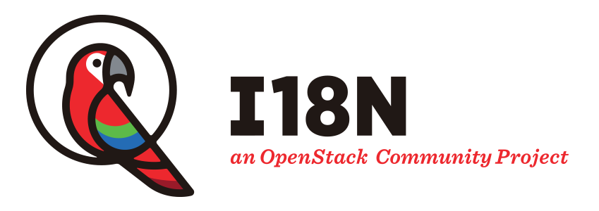

====================
OpenStack I18n Guide
====================

Internationalization (I18n) is essential to make OpenStack ubiquitous.
The mission of OpenStack I18n team is to make OpenStack
ubiquitously accessible to people of all language backgrounds,
by enhancing OpenStack software internationalization,
providing translation, maintaining a translation platform and
managing translation process for better quality of outcomes.

This guide provides detailed instructions on the I18n contribution
workflow and conventions to be considered by all contributors.

Contents
--------

.. toctree::
   :maxdepth: 2

   contributing
   bug_report
   handling_bugs
   official_translator
   lang_team
   ptl
   check_translation
   translation_tips
   glossary
   translation_stats
   tools
   i18n_team_meeting
   infra
   infra-debug
   project_setup
   reviewing-translation-import
   release_management
   about

.. _label-i18n-team-contact:

Getting in touch
----------------

Language translation team
~~~~~~~~~~~~~~~~~~~~~~~~~

Each language team has useful information to help our translation
efforts. It is worth visited.
You can find your language team at
https://wiki.openstack.org/wiki/I18nTeam/team.

.. _openstack_i18n_team:

OpenStack I18n team
~~~~~~~~~~~~~~~~~~~

* Mailing List: `openstack-i18n@lists.openstack.org
  <http://lists.openstack.org/cgi-bin/mailman/listinfo/openstack-i18n>`_
* IRC channel: ``#openstack-i18n`` on OFTC
* :doc:`IRC meeting <i18n_team_meeting>`

.. only:: html

   Search in this guide
   --------------------

   * :ref:`search`
